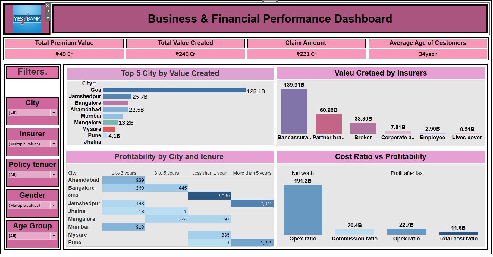
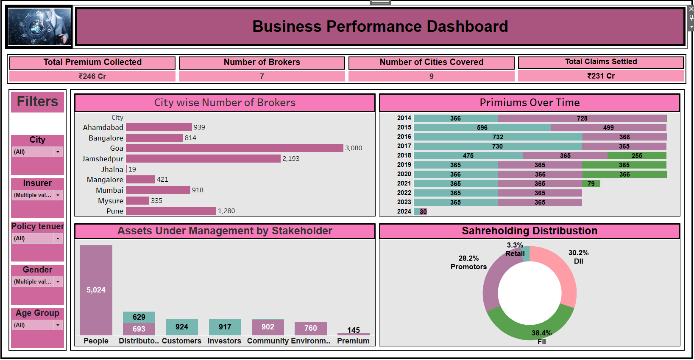

# 📊 Insurance Insights & Business Performance Dashboard  

A Tableau project by *Sagar Dabhade* showcasing interactive dashboards for analyzing *insurance business performance* and generating valuable insights.  
---

## 🎯 Business Problem  
Insurance companies need to monitor premiums, claims, and profitability across cities and insurers.  
This project helps stakeholders analyze business performance and identify growth opportunities using interactive dashboards.

---

## 📂 Project Structure  
- insurance_finance_records.csv → Dataset used for building dashboards  
- dashboards/ → Screenshots of Tableau dashboards  

---

## 🚀 Key Highlights  
✅ Analysis of Premiums, Claims, and Customer Age Distribution  
✅ City-wise & Insurer-wise Value Creation  
✅ Profitability by Policy Tenure and Cost Ratios  
✅ Stakeholder-wise Assets Under Management  
✅ Shareholding Distribution & Trend Analysis  

---

## 🖼️ Dashboards  

### 1️⃣ Business & Financial Performance Dashboard  
- KPIs: Total Premium Value, Total Value Created, Claim Amount, Average Age of Customers  
- City-wise Value Created  
- Value Created by Insurers  
- Profitability by City and Tenure  
- Cost Ratio vs Profitability  

---

### 2️⃣ Business Performance Dashboard  
- KPIs: Total Premium Collected, Number of Brokers, Number of Cities Covered, Total Claims Settled  
- City-wise Brokers Distribution  
- Premiums Over Time (Yearly Trend)  
- Assets Under Management by Stakeholder  
- Shareholding Distribution  

---

## 📌 Key Insights  
🔹 *Goa* generates the highest value among cities (₹128.1B).  
🔹 *Bancassurance partners* contribute maximum insurer value (₹139.91B).  
🔹 Profitability varies significantly with *policy tenure* (short-term vs long-term).  
🔹 Majority of assets are contributed by *People* and *Distributors*.  
🔹 *FII* hold the largest share in the company’s ownership (38.4%).  

---

## 🛠️ Tools & Technologies  
- *Tableau* → Data visualization & dashboarding  
- *Excel / CSV* → Dataset preparation  

---

## 👤 Author  
*Sagar Dabhade*
